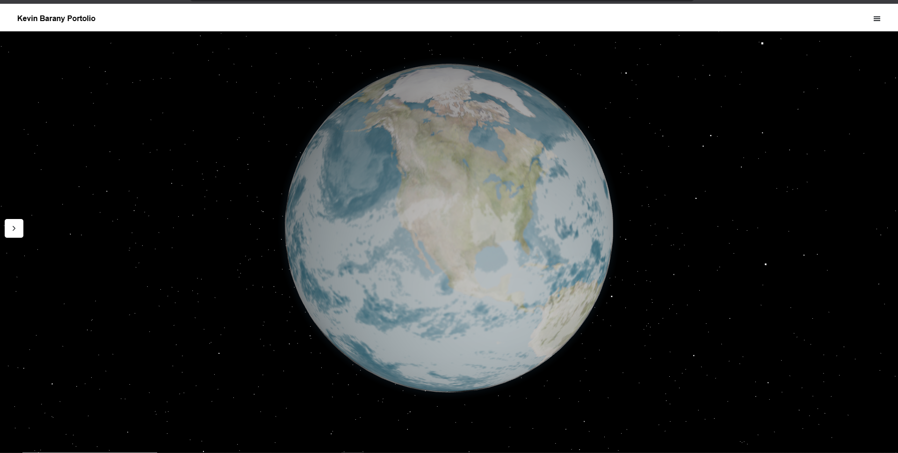
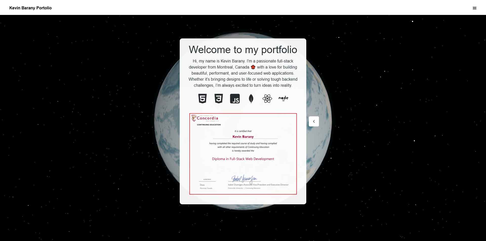

# Kevin Barany – Developer Portfolio 🚀

Welcome to my personal portfolio site! This project is a showcase of my work as a full-stack developer, built with performance, creativity, and clarity in mind.

🌐 [Live Site »](https://kevinbaranyportfolio.netlify.app)

---

## 📸 Preview




---

## 🛠 Tech Stack

- **Framework**: [React](https://reactjs.org/)
- **Build Tool**: [Vite](https://vitejs.dev/)
- **Styling**: `styled-components`, CSS
- **3D Graphics**: [Three.js](https://threejs.org/)
- **Deployment**: [Netlify](https://netlify.com)

---

## 📁 Project Structure

---

## 🚀 Getting Started

Clone the repo and install dependencies:

```bash
git clone https://github.com/YourUsername/new-portfolio.git
yarn install
yarn dev
```
